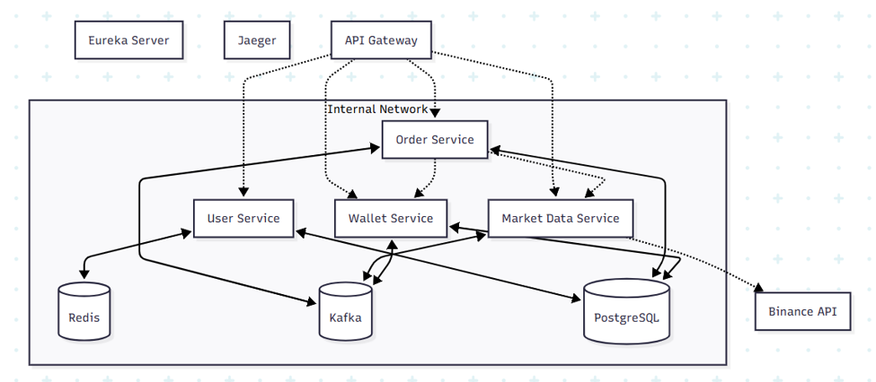

# Crypto Transaction Demo — Backend

Nền tảng mô phỏng giao dịch crypto bằng tiền giả lập, giúp người dùng trải nghiệm mua/bán mà không chịu rủi ro tài chính thực. Lợi nhuận/thua lỗ được tính dựa trên biến động giá thực tế của thị trường (kết nối trực tiếp Binance API), nhưng chưa bao gồm các loại phí giao dịch trên sàn.

Hệ thống mô phỏng đầy đủ vòng đời một giao dịch thực tế: lấy giá real-time, đặt lệnh Market / Limit / Stop Loss / Take Profit, và đóng vị thế.

## Mục lục

- [Tech stack](#tech-stack)
- [Kiến trúc hệ thống](#kiến-trúc-hệ-thống)
- [Mô tả các service](#mô-tả-các-service)
- [Cấu trúc thư mục](#cấu-trúc-thư-mục)
- [Cài đặt và chạy dự án](#cài-đặt-và-chạy-dự-án)
- [Xử lý lỗi thường gặp](#xử-lý-lỗi-thường-gặp)

## Tech stack

| Thành phần | Công nghệ |
|---|---|
| Ngôn ngữ | Java (Spring Boot) |
| Reactive Framework | Spring WebFlux |
| Bảo mật | Spring Security |
| ORM / Data Access | Spring Data JPA |
| API Gateway | Spring Cloud Gateway |
| Service Discovery | Netflix Eureka |
| Message Broker | Apache Kafka |
| Database | PostgreSQL (dùng chung) |
| Cache / Session Store | Redis |
| Distributed Tracing | Jaeger |
| Containerization | Docker (mỗi service 1 container) |

## Kiến trúc hệ thống


**Luồng dữ liệu chính:**
- `order-service` gọi REST trực tiếp tới `market-data-service` và `wallet-service` để kiểm tra giá/số dư trước khi khớp lệnh.
- `market-data-service` nhận sự kiện yêu cầu giá từ các service sau đó publish sự kiện giá lên Kafka. `wallet-service` lắng nghe Kafka để tính lợi nhuận real-time.`order-service` nhận dữ liệu và liên tục đối chiếu điều kiện trigger (TP/SL/LIMIT order) goi REST trực tiếp đến `wallet-service` khi khớp giá và đẩy sự kiện đóng vị thế khi chạm liquidation.
- Mọi request qua `api-gateway` đều được xác thực JWT trước khi forward.

## Mô tả các service

| Service | Port | Vai trò |
|---|---|---|
| **api-gateway** | 8000 | Cổng vào duy nhất của hệ thống, định tuyến request tới các service và xác thực JWT trước khi forward |
| **user-service** (cryptoshield) | 8080 | Xử lý đăng ký, đăng nhập, sinh và quản lý JWT cho người dùng |
| **wallet-service** | 8081 | Quản lý số dư và vị thế của người dùng, cộng/trừ tiền khi lệnh được khớp; nhận giá coin từ Kafka để tính toán và trả về stream vị thế kèm lợi nhuận real-time cho client |
| **order-service** | 8082 | Nhận và xử lý các loại lệnh (Market, Limit, TP/SL); gọi REST trực tiếp tới Market Data và Wallet để kiểm tra giá/số dư trước khi khớp lệnh; đóng vai trò engine liên tục lắng nghe giá từ Kafka để đối chiếu với các lệnh và vị thế đang mở |
| **market-data-service** | 8084 | Kết nối Binance API để lấy giá real-time, chỉ giữ kết nối tới những đồng coin đang thực sự cần theo dõi (tiết kiệm tài nguyên); cung cấp API stream giá và giá hiện tại, đồng thời publish sự kiện giá lên Kafka cho các service khác |
| **discovery-server** (Eureka) | 8761 | Service discovery — nơi tất cả service đăng ký khi khởi động và tra cứu địa chỉ lẫn nhau khi cần gọi request |

**Hạ tầng dùng chung:**
- **Kafka Cluster** — message broker trung gian giữa các service: mang yêu cầu giá từ Wallet/Order tới Market Data và chiều ngược lại, đồng thời truyền sự kiện yêu cầu đóng vị thế khi lệnh chạm điều kiện trigger.
- **PostgreSQL** — database dùng chung, lưu trữ dữ liệu nghiệp vụ của User, Wallet và Order Service.
- **Redis** — lưu danh sách các JWT đã logout (blacklist token), phục vụ việc kiểm tra token không còn hiệu lực ở User Service.
- **Jaeger** — công cụ distributed tracing, ghi log và truy vết đường đi của request xuyên suốt các service.
- **Binance API** — nguồn dữ liệu giá bên ngoài mà Market Data Service gọi qua REST/WebSocket để lấy giá thị trường thật.

*\* Port mặc định của Eureka, kiểm tra lại trong `docker-compose.yaml` nếu bạn đã đổi cấu hình.*

## Cấu trúc thư mục

```
cryptoshield-root/
├── api-gateway/            
├── discovery-server/       
├── order-service/          
├── market-data-service/    
├── cryptoshield/           (user-service)
│
├── wallet-service/
│   ├── .mvn/
│   ├── src/
│   │   └── main/
│   │       └── java/
│   │           └── com.crypto_shield.wallet_service/
│   │               ├── component/
│   │               ├── config/
│   │               ├── controller/
│   │               ├── dto/
│   │               ├── entity/
│   │               ├── enums/
│   │               ├── exception/
│   │               ├── repository/
│   │               └── service/
│   ├── target/              (build output, không commit)
│   ├── .env
│   ├── .gitattributes
│   ├── .gitignore
│   ├── docker-compose.yaml
│   ├── Dockerfile
│   ├── init-multi-db.sh
│   ├── HELP.md
│   ├── mvnw
│   ├── mvnw.cmd
│   └── pom.xml
│
├── .env                     (biến môi trường chung toàn hệ thống)
├── docker-compose.yaml      (khởi chạy toàn bộ các service cùng lúc)
└── pom.xml                  (parent POM, quản lý chung các module)
```

Các service còn lại (`api-gateway`, `discovery-server`, `order-service`, `market-data-service`, `cryptoshield`) có cấu trúc package tương tự `wallet-service` — theo layer `controller → service → repository → entity`, chỉ khác nhau ở các package đặc thù nghiệp vụ.

## Cài đặt và chạy dự án

### Yêu cầu

- **Docker Desktop** (Windows/Mac) hoặc **Docker Engine + Docker Compose** (Linux)
  → Tải tại: https://www.docker.com/products/docker-desktop
- Đảm bảo Docker đang chạy (mở Docker Desktop lên) trước khi thực hiện các bước bên dưới
- Git

Kiểm tra đã cài đúng:
```bash
docker --version
docker compose version
```

### Các bước

**1. Clone project**
```bash
git clone https://github.com/nguyennhathao438/Crypto_Shield.git
cd backend
```

**2. Cấu hình biến môi trường**

Tạo file `.env` ở thư mục gốc (copy từ `.env.example` nếu có sẵn), điền các giá trị cần thiết: thông tin database, port, secret key...

```bash
cp .env.example .env
```

Sau đó mở `.env` và điền/kiểm tra các biến quan trọng (tên biến thật tuỳ theo file `.env` của bạn), ví dụ:
```
DB_USERNAME=your_db_user
DB_PASSWORD=your_db_password
JWT_SECRET=your_secret_key
```

**3. Build và chạy toàn bộ hệ thống**
```bash
docker-compose up -d --build
```

Lệnh này sẽ build image và khởi động tất cả service: `discovery-server`, `api-gateway`, `cryptoshield` (user-service), `order-service`, `wallet-service`, `market-data-service` cùng Kafka, PostgreSQL, Redis, Jaeger.

**4. Kiểm tra các service đã chạy**
```bash
docker-compose ps
```

Tất cả container phải ở trạng thái `Up`. Nếu muốn xem log để debug:
```bash
docker-compose logs -f <tên-service>
```

**5. Truy cập**

| Service          | URL                    |
|------------------|------------------------|
| API Gateway      | http://localhost:8000  |
| Eureka Dashboard | http://localhost:8761  |
| Jaeger UI        | http://localhost:16686 |
| Kafka UI         | http://localhost:8090  |

*(Điền lại port thật theo `docker-compose.yaml` nếu bạn đã tuỳ chỉnh — bảng trên theo cấu hình mặc định của dự án.)*

**6. Dừng hệ thống**
```bash
docker-compose down
```

Muốn xóa luôn volume (dữ liệu database) để chạy lại từ đầu:
```bash
docker-compose down -v
```

## Xử lý lỗi thường gặp

| Lỗi | Nguyên nhân | Cách khắc phục |
|---|---|---|
| `Cannot connect to the Docker daemon` | Docker Desktop chưa mở | Mở Docker Desktop, đợi icon chuyển sang trạng thái running |
| Port đã được sử dụng (`port is already allocated`) | Có service khác đang chiếm port | Đổi port trong `docker-compose.yaml` hoặc tắt service đang chiếm port đó |
| Service không đăng ký được với discovery-server | Service khởi động trước khi `discovery-server` sẵn sàng | Đợi vài giây rồi thử lại, hoặc kiểm tra `depends_on` trong `docker-compose.yaml` |

## API Documentation

Xem chi tiết tại [API.md](API.md)